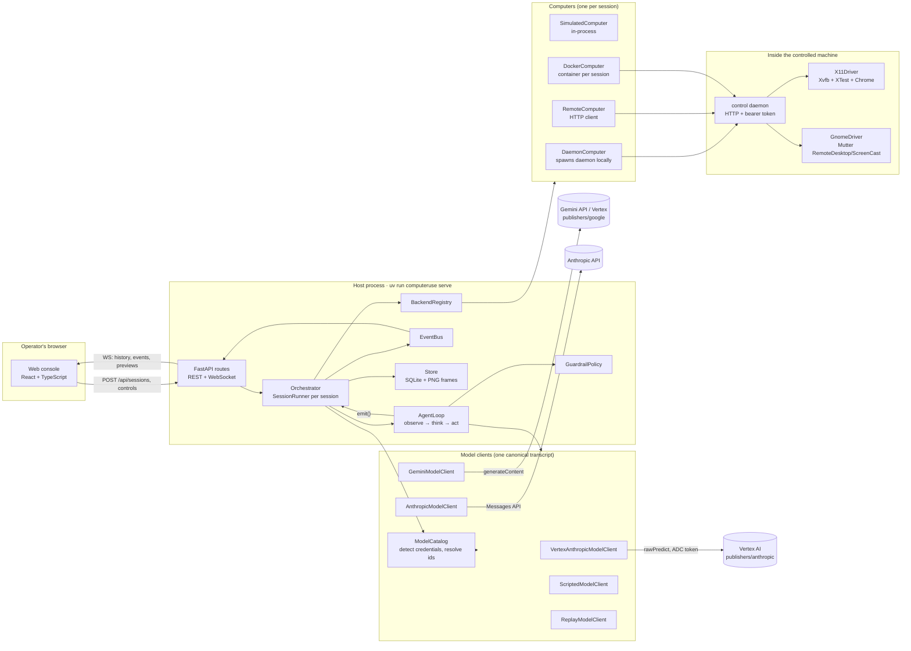
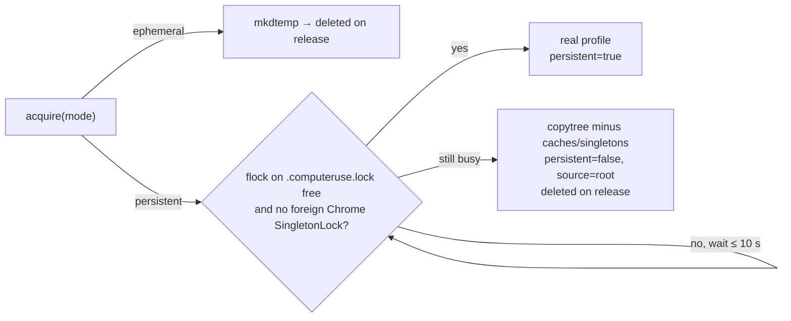
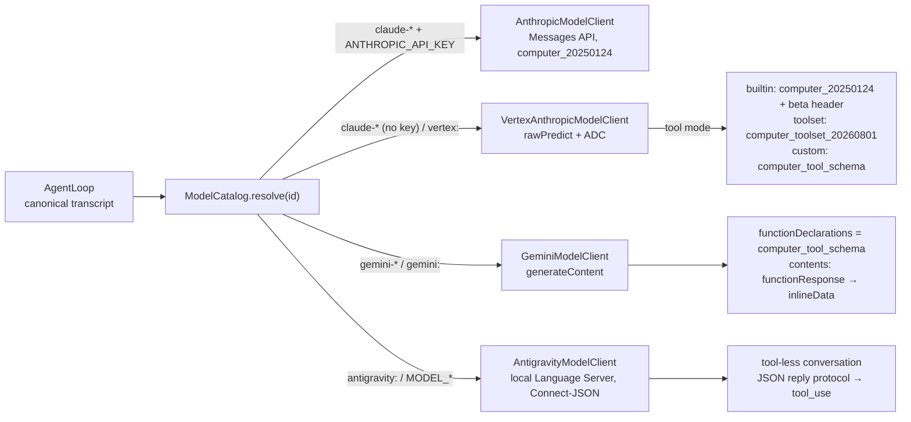
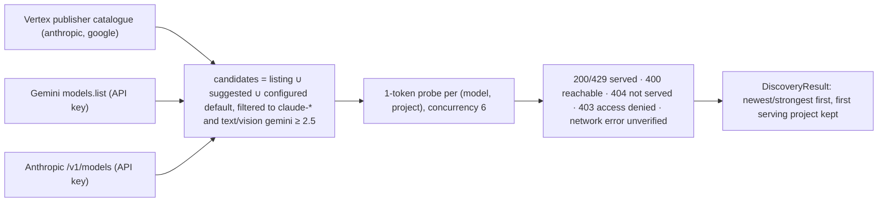
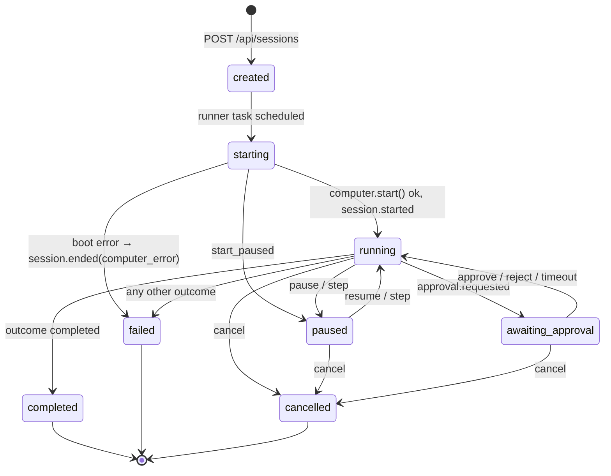
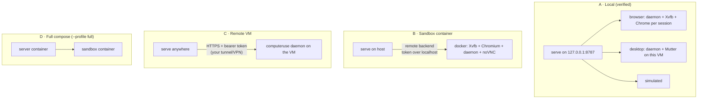

# Architecture

This document describes how `computeruse` works end to end: the computers it can
drive, the in-VM control daemon, the agent loop and its safety machinery, the
session orchestrator, the telemetry pipeline that feeds the web console and the
metrics, and the eval harness. It is written for an engineer who needs to change
the system, not just run it.

---

## 1. Goals and design principles

The system exists to turn "a model that can look at a screen and emit mouse and
keyboard actions" into a product surface that is **observable, controllable and
measurable**. Four principles shaped the design:

1. **One action model, many computers — and many models.** The loop speaks a
   single *canonical transcript* (Anthropic-style messages with a `computer`
   tool whose input is `{"action": ...}`). Every backend — real Chrome on a
   virtual display, the live GNOME desktop, a container, a remote VM, a
   simulated OS — consumes the same typed `Action` objects, and every model
   provider — Claude on Vertex AI, Claude on the Anthropic API, Gemini —
   translates to and from that transcript inside its client. The agent loop
   never knows which computer it is driving or which API served the model.
2. **Observable by construction.** The loop does not log; it *emits events*.
   Every event is persisted and broadcast. The web console, the metrics, the
   eval verdicts and the replay model client are all pure functions of that
   event stream. If the UI can show it, it is in the database.
3. **Success is verified, not claimed.** Evals attach a verifier that inspects
   real state (Chrome DevTools tab list, shell output in the VM, simulated OS
   state, recorded guardrail decisions). "The model said done" and "the task
   is done" are tracked separately so *false completions* are a first-class
   metric.
4. **Fail closed on the real desktop.** Isolation is a property of the backend
   and flows into guardrail decisions, UI warnings and scheduling (one desktop
   session at a time). Per-session overrides can only tighten policy.

## 2. System overview



A session is: one `Computer`, one `ModelClient`, one `AgentLoop`, one
`GuardrailPolicy`, one `SessionController`, wrapped in a `SessionRunner` that
owns telemetry. Sessions run as asyncio tasks inside the single server process;
the heavy lifting (X11, PipeWire, Chrome) runs in a separate daemon process per
session so a crash there cannot take the server down.

## 3. Repository map

| Path | Role |
|---|---|
| `computeruse/computer/actions.py` | Typed action union (the `computer_20250124` vocabulary plus toolset-era `zoom` and key `repeat`), lenient parser, `describe_action`, `MUTATING_KINDS`, `HARNESS_KINDS` |
| `computeruse/computer/base.py` | `Computer` ABC, `Frame` (PNG + sha1), `DisplayInfo`, `ComputerHealth`, `ComputerError` |
| `computeruse/computer/daemon.py` | **In-VM control daemon**: HTTP server, `X11Driver`, `GnomeDriver`. Stdlib + Pillow only, so it can be dropped into any VM |
| `computeruse/computer/keys.py` | xdotool-style chord parsing → X keysyms, Unicode → keysym |
| `computeruse/computer/remote.py` | `RemoteComputer` (HTTP client), `DaemonComputer` (spawns the daemon), `BrowserComputer` (Chrome + profile lease + orderly close), Chrome command line |
| `computeruse/computer/profile.py` | `BrowserProfile` / `ProfileLease`: persistent Chrome profile with lock, copy-on-contention and ephemeral leases |
| `computeruse/computer/sso.py` | `security_key_forwarding()`: which transport (remote-desktop session, SSH agent, none) a security-key prompt inside the sandbox Chrome can use |
| `computeruse/computer/simulated.py` | SimOS: deterministic fake desktop with fault injection |
| `computeruse/computer/docker_vm.py` | Container-per-session client over the same protocol |
| `computeruse/computer/registry.py` | Catalogue of backends, availability probes, `isolated` flag, construction |
| `computeruse/agent/loop.py` | `AgentLoop`, `RunConfig`, `SessionController`, `CoordinateScaler` |
| `computeruse/agent/guardrails.py` | Rules, decision precedence, `GuardrailPolicy.default` |
| `computeruse/agent/model.py` | Canonical transcript contract, `ModelTurn`, `AnthropicModelClient`, `ScriptedModelClient`, `ReplayModelClient`, `sanitize_for_anthropic` |
| `computeruse/agent/vertex.py` | `VertexAnthropicModelClient` (Claude on Vertex AI via ADC), tool-mode negotiation, toolset ⇄ canonical translation, `AdcTokenSource`, `detect_adc` |
| `computeruse/agent/gemini.py` | `GeminiModelClient` (Developer API key or Vertex), canonical ⇄ Gemini `contents` translation |
| `computeruse/agent/antigravity.py` | `AntigravityModelClient`: Antigravity's local Language Server as a provider (Connect-JSON client, model catalogue with quota, JSON reply protocol, one stateful conversation per session), `detect_antigravity` |
| `computeruse/agent/discovery.py` | `ModelDiscovery`: lists provider catalogues, verifies each (model, project) with a 1-token probe, ranks the result |
| `computeruse/agent/providers.py` | `ModelCatalog`: credential detection, model-id → provider resolution, suggested models with availability, client construction |
| `computeruse/agent/prompts.py` | System prompt per backend, built-in tool definition, `computer_tool_schema` (the same vocabulary as a JSON-schema function) |
| `computeruse/telemetry/events.py` | `EventType`, `Event`, `SessionStatus`, `Outcome`, `Usage`, pricing |
| `computeruse/telemetry/store.py` | SQLite (WAL) for sessions/events/eval runs, PNG frames on disk |
| `computeruse/telemetry/bus.py` | In-process pub/sub with per-session and global subscribers |
| `computeruse/telemetry/metrics.py` | `summarize`, `timeseries`, `readout_markdown` |
| `computeruse/server/orchestrator.py` | `Orchestrator`, `SessionRunner`, policy/model/config factories |
| `computeruse/server/operator.py` | `OperatorControl`: takeover bookkeeping and the privacy-preserving summary briefed to the model |
| `computeruse/server/routes.py` | REST + WebSocket API under `/api`, `InputPump` for operator input |
| `computeruse/server/schemas.py` | Request/response models |
| `computeruse/server/app.py` | `create_app`, lifespan, CORS, SPA static serving |
| `computeruse/evals/suite.py` | YAML suite loader, `TaskSpec`, verifier implementations |
| `computeruse/evals/runner.py` | Suite runner with concurrency, summaries, markdown report |
| `computeruse/cli.py` | `serve`, `run`, `eval`, `readout`, `doctor`, `daemon` |
| `web/src` | React console: pages, timeline derivation, screen overlays, stream hook, `lib/input.ts` (DOM events → computer actions) |
| `docker/` | Sandbox image (daemon + Chromium + noVNC), server image |
| `tests/` | Unit, API (TestClient incl. WebSocket), real-Xvfb driver tests |

## 4. The computer layer

### 4.1 Action model

`actions.py` defines a discriminated union (`screenshot`, `left_click`,
`right_click`, `middle_click`, `double_click`, `triple_click`, `mouse_move`,
`left_click_drag`, `left_mouse_down/up`, `type`, `key`, `hold_key`, `scroll`,
`wait`, `cursor_position`) matching the Anthropic tool surface, so a `tool_use`
block's `input` can be validated directly with `parse_action()`.

The parser is deliberately *lenient where the model is sloppy and strict where
it matters*: coordinates may arrive as lists, floats or numeric strings and are
normalised; negative coordinates, unknown actions, empty text and bad scroll
directions raise `ActionError`, whose message is fed back to the model as an
`is_error` tool result so it can self-correct. A click without `coordinate`
means "click where the cursor is", per the spec.

`MUTATING_KINDS` separates observations (`screenshot`, `cursor_position`,
`wait`, `mouse_move`) from actions that change state; the loop and the UI use
this to decide what deserves a settle wait and an overlay.

### 4.2 The `Computer` interface

```python
class Computer:
    display: DisplayInfo                      # physical width/height
    async def start() / stop()
    async def screenshot() -> Frame           # PNG bytes + sha1 + size
    async def execute(action) -> ActionResult # ok / output / error / duration_ms
    async def health() -> ComputerHealth
    def live_view_url() -> str | None         # optional noVNC etc.
```

`Frame.sha1` is the backbone of several features: screen-change detection,
settle detection, stuck detection and preview de-duplication all compare
hashes rather than pixels.

### 4.3 The control daemon

`computeruse/computer/daemon.py` runs **on the machine being controlled**. It is
a `ThreadingHTTPServer` with a tiny JSON API and a bearer token
(`COMPUTERUSE_DAEMON_TOKEN`, compared with `secrets.compare_digest`):

| Method & path | Purpose | Notes |
|---|---|---|
| `GET /health` | `{ok, driver, display:{width,height}, detail, live_view_url, uptime_s, actions}` | Used at boot and after a failed action |
| `GET /screenshot` | PNG of the full display | What the model sees (after scaling) |
| `GET /frame.jpg?q=60` | JPEG | Cheap frames for the live preview |
| `GET /devtools/tabs` | Chrome DevTools `/json` tab list, proxied from inside the sandbox | Lets `chrome_tab` verifiers work for remote/container sandboxes; 404 when the app has no `--remote-debugging-port` |
| `POST /action` | Execute one action dict → `{ok, output?, error?, duration_ms}` | Serialised by a driver lock; `wait` sleeps *outside* the lock |
| `POST /exec` | `{command, timeout}` → `{code, output}` | Used by the `shell` eval verifier |
| `POST /shutdown` | Graceful stop | |

Boot handshake: the daemon prints `LISTENING <host> <port> <WxH>` on stdout
once the driver is up. `DaemonComputer` spawns it with `--port 0`, reads that
line to learn the port, then re-creates its HTTP client against it. Stderr is
tailed into a ring buffer and attached to the session's `error` event if boot
fails, which turns "Chrome didn't start" from a mystery into a stack trace in
the UI.

Two drivers implement `start / stop / screenshot / execute`:

#### X11 driver (`browser`, `x11`, `docker` backends)

* **Private display.** With no `--display`, it boots its own `Xvfb` using
  `-displayfd <pipe>` so the X server itself picks a free display number and
  reports it back. (The original scan-then-spawn approach raced: two sessions
  booting at once could both grab `:90` and their keystrokes interleaved. A
  regression test boots three drivers concurrently and asserts distinct
  displays.)
* **App launch.** The `--app` command (a real Google Chrome with a fresh
  `--user-data-dir`, `--ozone-platform=x11` because the host session may be
  Wayland, `--window-size`/`--start-maximized`, first-run noise disabled, a
  `--remote-debugging-port` for verifiers) runs as a child on that display.
* **Observation.** `XGetImage` of the root window (ZPixmap, BGRX → RGB).
* **Input.** XTest fake events for motion, buttons (with timed multi-clicks) and
  keys. Typing arbitrary Unicode is the interesting part: for every keysym the
  driver looks for an existing keycode (level 0 or shifted), and if the current
  keymap has none (e.g. `é`, `✓`, emoji) it **remaps a spare keycode** via
  `XChangeKeyboardMapping`, waits briefly for clients to process
  `MappingNotify`, and caches the mapping. Chords (`ctrl+shift+t`) press
  modifiers in order and release in reverse; click modifiers (`text: "shift"`)
  are held around the click.
* **Isolation.** The display, the Chrome profile and the DevTools port are all
  per-session and discarded at stop. Nothing touches the user's own X/Wayland
  session.

#### GNOME driver (`desktop` backend)

Modern Linux workstations run GNOME Shell on Wayland (often headless under Chrome Remote
Desktop), where XTest cannot reach native windows. The driver therefore uses the
same private Mutter D-Bus APIs that gnome-remote-desktop uses:

1. `org.gnome.Mutter.RemoteDesktop.CreateSession(is_trusted=True)` (falls back
   to the argument-less form on older Mutter) → a RemoteDesktop session for
   **input**.
2. `org.gnome.Mutter.ScreenCast.CreateSession({remote-desktop-session-id})` and
   `RecordMonitor(connector, {cursor-mode})` → a **PipeWire** stream of the
   chosen monitor. The connector defaults to the primary monitor from
   `org.gnome.Mutter.DisplayConfig.GetCurrentState()` (e.g. `Meta-0`).
3. A GLib main loop in a thread receives `PipeWireStreamAdded(node_id)`; a
   GStreamer pipeline `pipewiresrc ! videoconvert ! RGB ! appsink
   (max-buffers=1, drop=true)` keeps only the latest frame.
4. `screenshot()` tries to pull a fresh sample for 250 ms and otherwise returns
   the last frame — Mutter only emits frames on damage, so a quiet screen
   legitimately produces no new sample.
5. Input goes through `NotifyPointerMotionAbsolute(stream, x, y)`,
   `NotifyPointerButton(evdev code)` and `NotifyKeyboardKeysym`, so no XKB
   gymnastics are needed: Mutter handles keysyms directly.

System `gi`/`dbus` bindings are not pip-installable, so `_ensure_system_gi()`
appends the distro's `dist-packages` to `sys.path` when running from a venv.

### 4.4 Simulated computer

`SimulatedComputer` is an in-process 1024×768 desktop ("SimOS") rendered with
Pillow: a dock with Notes, Calculator, Settings and a toy Browser, draggable
windows, focus, text entry, `ctrl+s`, close buttons, a calculator with real
arithmetic, and a browser that "loads" a few canned pages. It exposes
`state()` (for `sim_state` verifiers) and `locate("dock.notes" | "calc.7" |
"browser.url" | ...)` (so reference scripts can target widgets symbolically).
`SimFaults(click_drop_rate, screenshot_fail_rate, action_latency_ms, seed)`
injects deterministic flakiness to test the loop's retry and stuck paths. It is
an **eval and test fixture**, not a product surface.

### 4.5 Remote and Docker computers

`RemoteComputer` is the plain HTTP client for an already-running daemon
(`COMPUTERUSE_REMOTE_DAEMON_URL` + token, optional live-view URL for noVNC).
`DockerComputer` starts a container from `docker/Dockerfile` per session, maps
the daemon and noVNC ports, waits for health and then behaves like
`RemoteComputer`. The `remote` path is verified end to end against a standalone
daemon (`browser-smoke` 4/4). `DockerComputer` is verified against the genuine
daemon through a stand-in `docker` CLI (`tests/test_docker_vm.py`); the image
itself has not been built on the development machine, which has no Docker.

### 4.6 Registry and isolation

`BackendRegistry.list()` probes the environment (Chrome + Xvfb on `PATH`,
Mutter names on the session bus with importable `gi`/`dbus`, `docker` CLI,
remote URL configured) and returns `BackendInfo{id, label, description,
available, reason, isolated, options}`. `isolated=False` for `desktop` is
threaded into `GuardrailContext`, into the UI's warning banner and into the
orchestrator's one-desktop-session-at-a-time rule. The `browser` entry's
`options.profile` carries the shared profile's status (path, size, last use,
in-use) for the new-session form.

### 4.7 Browser profile lifecycle (`computer/profile.py`)

The `browser` backend keeps cookies, logins and SSO tokens between sessions in
one Chrome profile directory (`chrome_profile_dir`, default
`<data-dir>/chrome-profile`, mode `0700`). `BrowserProfile` hands out
`ProfileLease`s:



* `BrowserComputer.start()` takes the lease (in a thread; the wait covers the
  moment between a previous session's terminal status and its Chrome exiting),
  builds the Chrome command with `--user-data-dir=<lease.path>`, and releases
  the lease after `stop()` or a failed boot. `session_info()` exposes
  `lease.describe()` in `session.metadata.computer.profile`, which the session
  page shows as a pill (`persistent` / `ephemeral` / `copy (logins not saved)`).
* **Orderly shutdown matters.** Chrome's cookie store lives in its
  network-service process and is written out every ~30 s or on an orderly exit.
  Signalling the whole process group killed the helper before it could flush, so
  logins made late in a session were lost. The daemon now SIGTERMs the app's
  main process first and sweeps the group afterwards (`_stop_app`), and
  `BrowserComputer` additionally closes Chrome over DevTools (`Browser.close`,
  the Puppeteer route) when it holds the real profile.
* Stale `Singleton{Lock,Socket,Cookie}` files from a killed Chrome are removed
  before launch; a *live* foreign Chrome (its `SingletonLock` symlink names a
  running pid on this host) is never touched — the session gets a copy instead.
* Evals always request `profile: "ephemeral"`; `chrome_profile_mode` sets the
  default for everything else; `backend_options.profile` overrides per session.
* Not in the profile: client certificates and device-trust state come from the
  OS user's NSS database and enterprise policies, which Chrome applies to any
  profile.

**Enterprise policy and corporate SSO.** Chrome reads system policy files and
enrols in cloud browser management per *machine*, so the sandbox profile is as
managed as the user's own: the first start fetches the cloud policy and its
`ExtensionSettings` force-list, and the extension updater installs the listed
extensions (on a corporate Linux host: security-key forwarding, device trust /
endpoint verification, reporting). That is why `chrome_command` must **not**
pass `--disable-background-networking` — it silently disables the updater and
the force-list never materialises (verified: with the flag, only Chrome's
component extensions after 45 s; without it, nine policy extensions). The
remaining gap is physical: the sandbox runs on a virtual display on a machine
with no security key, so the WebAuthn step of SSO has to be forwarded. The
forwarding transport is whatever the *server's* environment carries into
Chrome (`shell_env()` is `os.environ` plus `DISPLAY`):

| transport | what Chrome inherits | who answers the prompt |
|---|---|---|
| remote desktop | `CHROME_REMOTE_DESKTOP_SESSION=1` + `$XDG_RUNTIME_DIR/chromoting.host_services_mojo_ipc`; the policy-installed "Chrome Remote Desktop Security Key" extension proxies WebAuthn through the host's native-messaging helper (Chromium checks that variable before connecting: `remoting/host/chromoting_host_services_client.cc`) | the key plugged into the remote-desktop *client* machine |
| SSH agent | `SSH_AUTH_SOCK` → an agent that forwards security-key operations | the key on the SSH client |
| none | — | nobody: use a one-time security code |

`computer/sso.py::security_key_forwarding()` reports which case applies; the
registry attaches it to the `browser` backend as `options.security_key`, the
new-session form shows it under the profile picker, and `computeruse doctor`
prints it as "security keys". Nothing in the harness touches credentials: the
operator completes the login through live control (§5.9).

## 5. The agent loop

### 5.1 One step, end to end

```mermaid
sequenceDiagram
    participant UI as Console
    participant L as AgentLoop
    participant G as Guardrails
    participant M as Model client
    participant C as Computer
    participant R as Recorder (SessionRunner)

    L->>L: checkpoint(consume=false) — pause point, budgets, cost
    L->>L: inject operator instructions / manual-action notes, prune old images
    L->>R: turn.started
    L->>M: create(system, messages, tools)
    M-->>L: ModelTurn(content, tool_uses, usage, latency)
    L->>R: model.called, assistant.text*
    alt no tool_use, stop_reason = max_tokens (≤ 2×)
        L-->>M: "your reply was cut off; continue" appended, next turn
    else no tool_use
        L->>R: session.ended(completed)
    else for each tool_use
        L->>L: checkpoint(consume=true) — "Step" spends exactly one action here
        L->>L: parse + scale coordinates / zoom region to physical pixels
        L->>R: action.proposed
        L->>G: evaluate(action, ctx{backend, isolated, step})
        G-->>L: allow | require_approval | block
        L->>R: guardrail.decision
        opt require_approval
            L->>R: approval.requested
            UI-->>L: approve / reject
            L->>R: approval.resolved
        end
        L->>L: stuck detection on (action, screen sha1)
        alt zoom (harness observation)
            L->>C: screenshot
            L->>L: crop region, upscale to the model display, frame(kind=zoom)
            L-->>M: tool_result(mapping note + magnified image)
        else
            L->>C: execute(action)  (key repeat unrolled; retry once after a health check)
            L->>C: settle: sleep settle_ms, screenshot until two hashes match
            L->>R: frame, action.executed(screen_changed, duration_ms)
            L-->>M: tool_result(text + screenshot) appended to messages
        end
    end
```

### 5.2 Context construction

* **System prompt** (`prompts.py`): capability block with the *model-space*
  display size, backend-specific notes (Chrome fills the screen → use `ctrl+l`;
  real GNOME desktop → never touch unrelated windows; SimOS layout), behavioural
  rules (narrate briefly, prefer keyboard, don't repeat a click that did
  nothing, zoom before acting on tiny text, never enter credentials unless the
  task provides them, don't claim success you can't see), and an optional
  `system_prompt_extra` from the task.
* **Tool definition**: the loop always hands the client the built-in
  `{"type": "computer_20250124", "name": "computer", "display_width_px",
  "display_height_px"}`. Each provider decides how that reaches the model —
  as-is with the `computer-use-2025-01-24` beta, as the newer
  `computer_toolset_20260801`, or as the equivalent JSON-schema function
  (`computer_tool_schema`) — see §5.10.
* **Messages**: first user turn = task text + initial screenshot. Each tool
  result carries the post-action screenshot (plus text such as the cursor
  position, an error, or a stuck nudge). Transcript validity is preserved even
  when a session ends mid-turn: every `tool_use` gets a paired `tool_result`.
* **Image pruning**: only the newest `screenshot_history` (default 3) images
  stay in context; older ones are replaced with a short text placeholder. This
  bounds token cost and keeps latency flat over long sessions.

### 5.3 Coordinate scaling

Claude works best under ~1.15 MP with a long edge ≤ 1568 px. `CoordinateScaler`
picks a model-space size (exact aspect-ratio targets such as 1280×960 →
1024×768, otherwise a proportional fit), downsizes screenshots before they are
sent, scales model coordinates **up** to physical pixels before execution, and
— the easy-to-miss half — scales `cursor_position` output **back down** into
model space so the model's mental coordinate system stays consistent. Telemetry
always stores physical coordinates; the UI maps them onto whatever frame size
it renders.

### 5.4 Settle detection

After a mutating action the loop sleeps `settle_ms` (350 ms) and then captures
until two consecutive frames have the same hash (up to `settle_checks` × 150
ms). Page loads and animations therefore cost a few hundred milliseconds
instead of a wasted turn; observations (`screenshot`, `wait`,
`cursor_position`) skip the wait.

### 5.5 Budgets and outcomes

Checked at every turn boundary: `max_steps` (also enforced mid-turn),
`max_turns`, `max_duration_s`, `max_cost_usd` (cost from the pricing table in
`events.py`, including cache read/write multipliers). Defaults come from
`COMPUTERUSE_DEFAULT_*`; a session may set its own at creation (`max_steps` up
to 5000, `max_turns` up to 10 000, `max_duration_s` up to 24 h) and the
operator can **raise or lower them while it runs** with the `budget` control:
the loop reads its `RunConfig` at every check, so the change applies at the
next boundary. A new `max_steps` must exceed the steps already taken (409
otherwise), and a session that has already ended cannot be extended. Each
change is recorded as `budget.changed` and the current limits travel in
`metadata.budget`, so the console shows "steps 37 / 40" and offers +20 / +100.
Every session ends with exactly one `Outcome`:

| Outcome | Meaning |
|---|---|
| `completed` | model ended its turn without tool use (its *claim* of success) |
| `max_steps` / `timeout` / `budget_exceeded` | a budget tripped |
| `stuck` | the same action on the same screen hash kept producing no change |
| `guardrail_blocked` | four consecutive blocked actions |
| `model_error` | API failure after retries (or non-retryable) |
| `computer_error` | backend failed and did not recover after a health check |
| `cancelled` | operator cancel |
| `internal_error` | harness bug — the traceback is in an `error` event |

### 5.6 Stuck detection

The loop keys each action on `(action JSON, screen sha1 before it)`. When the
same key repeats `stuck_threshold` times (default 3) the model receives one
nudge in the tool result ("you have performed X n times on an unchanged screen…
re-read the screenshot, try a different interaction, or explain why the task
cannot be completed") and a `stuck.nudged` event is emitted; at 2× the
threshold the session ends as `stuck`. Repeated `wait`s on an unchanged screen
count too — "waiting forever" is one of the most common real failure modes.

### 5.7 Resilience

* **Model**: every client retries rate limits, 5xx/529 overloads and
  connection errors with backoff (`model_max_retries`), records `retries` and
  latency per call, and raises `ModelError` otherwise. The Vertex client also
  *adapts* instead of failing: a 400 about the tool definition switches tool
  mode (builtin → toolset → JSON schema), a 400 about `cache_control` or
  thinking drops that feature, and a 404 marks the location dead and tries the
  next one (`global` first, then regional). Adaptations are logged as warnings
  and capped per call so a genuinely bad request still surfaces.
* **Truncated turns**: a turn that ends with `stop_reason=max_tokens` and no
  tool call is not a completion. The loop records a recoverable `error` event,
  appends a short "continue; keep reasoning brief" user turn and asks again, at
  most `MAX_TRUNCATED_TURNS` (2) times before accepting the text as final.
* **Computer**: a failed `execute` triggers a health check and one retry; a
  failed screenshot retries with backoff. If the computer is unhealthy the
  session ends as `computer_error` with the daemon's stderr tail attached.
* **Boot**: boot failures bypass the loop and are still recorded as a proper
  `session.ended(computer_error)` so the UI never shows a session stuck in
  `starting`.
* **Restart**: on startup the store marks any session left in a non-terminal
  status as `failed` with outcome `internal_error` and reason "server restarted
  mid-session", so metrics and the sessions list stay honest.

### 5.8 Guardrails

`GuardrailPolicy` is an ordered rule list; `BLOCK` wins over
`REQUIRE_APPROVAL` wins over `ALLOW`. Rules receive a `GuardrailContext`
(backend, task, step, `isolated`, recent actions):

| Rule | Trigger | Decision |
|---|---|---|
| `blocked_keys` | chords such as `ctrl+alt+Delete`, `ctrl+alt+BackSpace`, VT switches | block |
| `blocked_keys` (desktop) | `alt+F4`, `super+l`, `ctrl+q`, … **only when `isolated=False`** | block |
| `domain_policy` | typed text that navigates (URLs, `www.`, bare `host.tld⏎`) to a blocked host or, if an allowlist exists, to a host outside it | block |
| `sensitive_text` | type length over `max_type_length` | block |
| `sensitive_text` | destructive shell (`rm -rf`, `mkfs`, `dd if=`, `shutdown`, `git push --force`, `DROP TABLE`, `sudo`) | require approval |
| `sensitive_text` | card numbers, SSNs, `password=…`, `sk-…` API keys | require approval |

Blocked actions return an error tool result that tells the model to choose a
different approach; approvals suspend the loop (`awaiting_approval`) until the
operator decides or `approval_timeout_s` elapses (then treated as rejected).
`auto_approve` exists for headless eval runs.

**Per-session tightening.** Tasks and API callers may pass
`guardrails: {allowed_domains, blocked_domains, blocked_keys, max_type_length}`.
`Orchestrator.make_policy` unions extra block lists, intersects an allowlist
with the global one (so a session can narrow but never widen it) and takes the
minimum type length. This is what makes guardrail negative-controls testable
inside an eval suite.

### 5.9 Operator controls

`SessionController` is shared between the loop and the API:

| Control | Semantics |
|---|---|
| `pause` | loop blocks at the next checkpoint; status `paused` |
| `step` | exactly **one action** executes, then it pauses again. The loop has two checkpoints per action (turn start, before each tool use); only the action-boundary checkpoint *consumes* the step allowance, so a step never stops before doing anything |
| `resume` | clears pause and allowance |
| `cancel` | raises `SessionCancelled` at the next checkpoint, resolves any pending approval as rejected, aborts a boot in progress |
| `approve` / `reject` | resolves the pending approval id |
| `instruct` | queues text that is injected into the next model call as "Operator guidance: …" and recorded as `user.instruction` |
| `budget` (`max_steps?`, `max_turns?`, `max_duration_s?`, `max_cost_usd?`) | rewrites the running session's limits in place (§5.5); 409 when nothing changes, when `max_steps` is not above the steps already taken, or when the session is no longer active |
| manual action (`POST /manual`) | allowed only while paused / awaiting approval: executes a raw action on the computer, captures a frame, records `manual.action`, and notes it so the next model call learns "while paused the operator did X; a fresh screenshot is attached". Typed text is recorded only as a character count |
| `take_control` | pauses the agent if needed and marks the session as operator-driven (`metadata.operator_control`); raw input is accepted as soon as the loop reaches its checkpoint |
| `release_control` (`resume: bool`) | lets go of a held mouse button, captures an `after_control` frame, records an `operator.control` event with a summary of the takeover, briefs the model with it, and optionally resumes. `resume`/`step` while in control release it first |

#### Operator control (live takeover)

```mermaid
sequenceDiagram
    participant UI as Console
    participant API as API / SessionRunner
    participant Loop as AgentLoop
    participant PC as Computer
    UI->>API: POST control take_control
    API->>Loop: controller.pause()
    API-->>UI: operator.control {state: taken, waiting_for_pause}
    Loop-->>API: status paused (checkpoint reached)
    loop while the operator drives
        UI->>API: ws {type: input, action, id?}
        API->>PC: execute(action) under the session lock
        API-->>UI: input_result (ids and failures only)
        API-->>UI: preview frames at control_preview_fps
    end
    UI->>API: POST control release_control {resume}
    API->>PC: left_mouse_up if held, screenshot
    API-->>UI: frame {kind: after_control}, operator.control {state: released, summary}
    API->>Loop: note_manual_action(summary); resume()?
```

* **State lives server-side** in `record.metadata["operator_control"]`, so every
  connected viewer agrees on who is driving, and it is cleared when the session
  ends for any reason.
* **Input channel.** The session websocket accepts `{"type": "input", "action":
  {...}, "id"?: n}`. `InputPump` executes discrete actions strictly in order,
  collapses pointer moves to the latest position, and merges consecutive `type`
  payloads, so a slow computer never builds a backlog of stale hovers. Replies
  (`input_result`) are sent for inputs that carry an `id` and for every failure.
  Nothing is persisted per input; `zoom`/`screenshot`/`cursor_position`/`wait`
  are refused as operator input.
* **Privacy.** `OperatorControl` keeps counts (clicks, typed characters, named
  key chords, scrolls, drags) and renders one summary at hand-back; keystroke
  content never reaches the event store or the model transcript.
* **Hand-back.** The `after_control` frame becomes the loop's `last_frame`, so
  the model's next turn sees exactly the screen the operator left, together with
  the summary ("while paused the operator did: manual control for 1m 12s (…)").
* **Console side.** `ScreenView` becomes a focusable input surface: pointer
  events are mapped to display coordinates (`toDisplayCoordinate`), left
  press/release becomes `left_mouse_down`/`left_mouse_up` (so drags and X11
  double-click timing work naturally), modified clicks are sent as one
  `left_click` with the modifier chord, wheel deltas are accumulated into
  `scroll` clicks, `keyAction` turns DOM keys into the harness' key vocabulary
  (`⌘`→`ctrl`), `ctrl+v` lets the browser raise `paste` so the operator's local
  clipboard is typed into the computer, and holding Esc releases control.

### 5.10 Model providers

The loop, the event store, replay and the console only ever see the **canonical
transcript**: Anthropic-style `messages` whose assistant content is `text` /
`thinking` / `tool_use(name="computer", input={"action": …})` blocks and whose
user content carries `tool_result` blocks with text and base64 PNG `image`
parts. Every provider translates to and from that shape inside `create()`, so a
recorded session replays identically regardless of which API produced it, and
metrics slice by `model` without caring about the route.



**Why Vertex.** Where the public Anthropic API is unreachable, or no Anthropic
key exists, Vertex AI's Anthropic publisher endpoint with Application Default
Credentials (`POST …/publishers/anthropic/models/{model}:rawPredict`, body
`anthropic_version: vertex-2023-10-16`) serves the same Claude models.
`AdcTokenSource` loads ADC lazily, refreshes tokens off the event loop, and the
`gcloud` default project is deliberately ignored when it is a `cloudtop-*`
workstation project (those cannot host the AI APIs); `GOOGLE_CLOUD_PROJECT`
must name a project with publisher access.

**Catalog.** `ModelCatalog` probes credentials once at startup (ADC presence +
project(s), `ANTHROPIC_API_KEY`, `GEMINI_API_KEY`, reachability of an
Antigravity Language Server — which also yields its model list), honours the
`COMPUTERUSE_MODEL_PROVIDER` preference (`auto` / a hard pin / `none`), resolves
a model id to `(provider, bare id)` — explicit `vertex:` / `anthropic:` /
`gemini:` / `antigravity:` prefixes win, and a bare `MODEL_*` enum routes to
Antigravity — and reports model ids with availability and a human reason. `GET /api/config`, `GET /api/models`, the console's model picker,
`computeruse doctor` / `computeruse models` and `POST /api/sessions` validation
all read the same catalog, so the UI can never offer a model the server would
refuse.

**Discovery (which ids are really callable).** Credentials say a provider is
reachable; they do not say which models it will serve. Probed 2026-10: the
Vertex publisher catalogue lists twelve Claude models, one project served two
of them (`claude-opus-5-5`, and `claude-sonnet-4-5` — which is no longer in
the catalogue), `claude-fable-*` answered 403 until publisher data-sharing is
enabled, everything else 404s, and a second project served `claude-sonnet-5`
only. A per-model GET 404s for served and unserved models alike, so there is no
cheap access check. `ModelDiscovery` therefore works in two phases:



Discovery is asynchronous and never blocks startup: the app lifespan starts it
as a background task, `/api/models` is polled by the picker while it runs, and
`POST /api/models/refresh` forces a re-run (concurrent callers share one run;
results are cached for `model_discovery_max_age_s`). Until it lands, the
catalog serves the suggested ids with provider-level availability. Once it has,
`models()` lists discovered ids (available first, configured default first)
with `verified`, `source`, `project`, `version` and `stage`; `check()` refuses
an id discovery saw fail (✗ in the picker, 400 from `POST /api/sessions`)
while still allowing ids discovery never saw, so a brand-new build can be typed
in and validated by its first request; and `make()` orders the Vertex
client's projects so the serving one goes first. Listing failures are reported
per provider and the suggested ids are still probed. `probe` / `list` / `off`
modes trade verification for zero network calls.

**Multiple projects.** `GOOGLE_CLOUD_PROJECT` accepts a comma-separated list.
`VertexAnthropicModelClient` then rotates over `(project, location)` targets,
location-major so every project's `global` endpoint is tried before any
regional fallback: a 404 marks one target dead, a 403 (project-scoped —
permission or data-sharing) marks all of that project's targets dead and falls
through to the next project, a 401 fails immediately because credentials are
shared. Billing follows the project in the request path, so the per-session
cost estimate is per model, not per project.

**Vertex tool modes.** Different Claude builds expose the computer tool
differently, and the API reports that only as a 400 on the request:

| Mode | Wire format | When |
|---|---|---|
| `builtin` | the loop's `computer_20250124` tool, beta flag as the `anthropic-beta` *header* (the body field is rejected on Vertex) | Claude 4.x (`claude-sonnet-4-5` verified) |
| `toolset` | `tools: [{"type": "computer_toolset_20260801"}]` — no name or display fields allowed. The API serves one tool per action and tags calls with `toolset_name: "computer"`; every `tool_result` must echo it | Claude 5.x (`claude-opus-5-5` verified) |
| `custom` | `computer_tool_schema(display)`: the same action vocabulary as a flat JSON-schema tool | any model; last resort |

`default_tool_mode` picks by major version (≥ 5 → toolset, any family name) and `_adapt`
walks the remaining modes on a tool-related 400. In toolset mode the canonical
`tool_use(computer, {action: left_click, …})` becomes a member call
`tool_use(left_click, {…}, toolset_name=computer)` on the way out and is folded
back on the way in, so the transcript stored for the session is identical to
what a builtin-mode session would store. `thinking` blocks returned by the
model are passed back verbatim (they carry signatures the API checks);
provider-private keys such as Gemini's `thought_signature` are stripped by
`sanitize_for_anthropic` before any Anthropic-shaped request.

**Gemini.** General Gemini models have no built-in computer tool, so the
`computer` function is declared from `computer_tool_schema` and the transcript
is translated part by part: user text/images → `text` / `inlineData`; assistant
text and `tool_use` → `text` / `functionCall` (echoing the `thoughtSignature`
Gemini 3 requires on the next request); `tool_result` → `functionResponse`
whose screenshot is attached as a following `inlineData` part. Within one user
turn all function responses come first, then their images, so the response
count always matches the previous turn's calls; consecutive same-role turns
(e.g. an operator nudge after a tool result) are merged, which Gemini requires.
Thought parts are dropped; `MAX_TOKENS` maps to `stop_reason=max_tokens` so the
loop's truncation recovery applies. The same client serves the Developer API
(`x-goog-api-key`) and Vertex (`publishers/google/models/*`, ADC) because the
bodies are identical. The dedicated `gemini-2.5-computer-use-preview` model
speaks a different action vocabulary and is not wired up.

**Antigravity.** Google Antigravity's local **Language Server** (the process
behind its UI and IDE extensions, `localhost:5387` by default) offers whatever
models the installation is entitled to — including builds that are not on the
public APIs — over Connect RPC with JSON bodies, so `antigravity.py` talks to it
directly with `httpx`: no SDK, no subprocess. Detection scrapes the CSRF token
from the server's index page (or takes `ANTIGRAVITY_CSRF_TOKEN` /
`COMPUTERUSE_ANTIGRAVITY_CSRF_TOKEN`; the token is a secret and never leaves the
process) and calls `GetCascadeModelConfigData`, whose per-user list carries
entitlement, image support and remaining quota — so discovery *lists* these
models and never probes them (a probe would leave a conversation in the user's
history). Unknown ids are rejected by the catalog because the server would
silently accept them. A session maps onto **one conversation**: `StartCascade`
with a tool-less custom agent spec (our system prompt is the whole prompt, no
tools, command execution off — the model can only answer, never act on the
host), titled `computeruse · <task>` and archived at the end
(`COMPUTERUSE_ANTIGRAVITY_ARCHIVE`). The transcript is stateful on the server,
so each `create()` sends only the canonical messages appended since the last
call — the task, or the tool results with their screenshots as inline PNG
`media` — through `SendUserCascadeMessage` with `blocking: true`, then reads the
new planner steps (`GetCascadeTrajectorySteps`) for the reply, thinking, stop
reason and `modelUsage`. Because no tool is wired to the agent, the `computer`
tool rides on a **JSON reply protocol** appended to the system prompt: the
model answers with one `{"action": …}` object per turn (optionally preceded by
one sentence), a plain reply with no object is the final answer, and
`parse_reply` converts that back into canonical `text` / `tool_use` blocks so
the loop never sees the difference. Consequences: no function calling, so weak
models may drift from the protocol (an empty reply gets one nudge); the server
keeps every screenshot (`COMPUTERUSE_SCREENSHOT_HISTORY` does not apply, and
context grows per step until the server truncates); `STOP_REASON_MAX_TOKENS`
maps to `max_tokens`; usage is recorded but no USD cost is attributed (quota,
not billing); and it only works on a machine where a Language Server runs.

**Toolset-era actions in the harness.** The toolset exposes two things the
2025 tool did not, and both are handled generically so every provider gets
them:

* `zoom(region=[x0, y0, x1, y1])` is a *pure observation answered by the loop*
  (`HARNESS_KINDS`): it scales the region to physical pixels like any
  coordinate, clamps it to the screen, crops a fresh capture, upscales so the
  longest edge fits the model display, saves a `frame(kind=zoom)` for the
  timeline, and returns the image with a note giving the model-space region and
  the per-axis mapping formula — because pixel coordinates inside a zoomed
  image are not screen coordinates. Regions under 4 px after clamping become a
  tool error rather than a crash. Zoom never reaches the backend, so it works
  on every computer and never counts as a mutating action for stuck detection.
* `key(text, repeat=N)` is unrolled into `N` single presses by
  `_execute_with_retry`; the first failure stops the batch and the recorded
  `action.executed` carries the summed duration and the `press X ×N`
  description.

**Cost.** `estimate_cost_usd` matches the longest known price prefix after
stripping any provider prefix (`antigravity:*` is always `None`: quota, not
billing). Prices for Opus 5.5 and the Gemini 3.x family
are marked as assumptions in `telemetry/events.py`; `COMPUTERUSE_PRICING_OVERRIDES`
replaces them without a code change, and the per-session `cost_usd` budget uses
whatever the table says.

## 6. Sessions and orchestration

### 6.1 Lifecycle



Status is **derived from events** in `SessionRunner._apply`, never set ad hoc:
`session.started` → running/paused, `approval.requested` →
awaiting_approval, `session.ended` → completed/failed/cancelled by outcome.
That keeps the DB, the WebSocket snapshots and the UI consistent by
construction.

### 6.2 `SessionRunner`

Per session it:

* creates the computer (not started), model client, `RunConfig` (global
  defaults + per-session overrides; the simulated backend gets zero settle
  time) and policy;
* runs `computer.start()` → `AgentLoop.run()` → optional verifier, inside one
  asyncio task, with a `finally` that stops the computer (bounded by 30 s),
  closes the session's bus channel and schedules the runner's removal after
  two minutes so late WebSocket joins still get fast history;
* implements the loop's `Recorder` protocol: `emit()` assigns a monotonically
  increasing `seq`, applies the event to the `SessionRecord`, persists both
  (except `preview`) and publishes to the bus; `save_frame()` writes the PNG
  under `data/sessions/<id>/frames/<seq>.png` off the event loop;
* runs a **preview loop**: while anyone is subscribed to the session it fetches
  a JPEG (`/frame.jpg` for daemon-backed computers, re-encoded PNG otherwise)
  at `preview_fps`, de-duplicates by hash and publishes transient `preview`
  events. Previews are never persisted — the authoritative frames are the PNGs
  captured by the loop.

The orchestrator additionally rejects a second concurrent `desktop` session
(two agents fighting over one mouse is never intended) and validates backend
availability before creating anything.

## 7. Telemetry

### 7.1 Event schema

Every event is `{session_id, seq, ts, type, data}`. The important payloads:

| Type | Key fields |
|---|---|
| `session.started` | task, backend, model, display (physical), model_display, config, live_view_url |
| `turn.started` | turn, step; also `phase: "booting computer"` (seq 0) and `phase: "eval_check"` with `passed`/`detail` |
| `model.called` | turn, latency_ms, retries, stop_reason, usage, model, n_tool_uses, **content** (full assistant blocks, used by replay), cumulative_cost_usd |
| `assistant.text` | turn, text |
| `action.proposed` | step, turn, tool_use_id, kind, action (physical), model_input (as sent by the model), description, coordinates |
| `guardrail.decision` | step, decision, rule, reason |
| `approval.requested` / `approval.resolved` | approval_id, kind, description, rule, reason / approved |
| `frame` | seq, url, width, height, sha1, kind (`initial`, `after_action`, `manual`, `after_manual`, `after_control`), step |
| `action.executed` | step, kind, ok, error, output, duration_ms, total_ms, description, coordinates, frame_seq, **screen_changed**, blocked, rejected |
| `stuck.nudged` | step, repeats, description |
| `session.paused` / `session.resumed` | step, turn |
| `budget.changed` | changes (the fields set), before, budget (all four limits after the change), steps, turns |
| `user.instruction` / `manual.action` | text / description, kind, ok, coordinates |
| `operator.control` | state (`taken` with status, waiting_for_pause / `released` with duration_s, clicks, typed_chars, keys, scrolls, drags, errors, inputs, summary, resumed) — never keystroke content |
| `error` | where (`boot`, `computer`, `model`, `loop`), message, traceback |
| `session.ended` | outcome, reason, final_text, steps, turns, duration_ms, usage, cost_usd |
| `preview` | jpeg_b64 — transient, bus only |

### 7.2 Storage

SQLite in WAL mode (`sessions`, `events`, `eval_runs`, indexed by creation time,
eval run and event type) plus PNG frames on disk. Writes are synchronous and
small; frames are the only large objects and are written in a thread. The
store is also what `ReplayModelClient` reads: `replay:<session_id>` re-issues
the recorded `model.called` content turn by turn, so a harness bug seen in
production can be reproduced locally with zero model calls.

### 7.3 Event bus and WebSocket protocol

`EventBus` holds bounded queues per session plus global subscribers. The
session socket `WS /api/sessions/{id}/ws`:

1. subscribes **before** loading history (no gap), then sends
   `{"type":"history","session":…,"events":[…]}`;
2. streams `{"type":"event","event":…}` — with a `session` snapshot attached
   whenever the event changes status — de-duplicated by `seq` against history;
3. sends `{"type":"heartbeat","session":…}` periodically so clients can detect
   stalls;
4. sends `{"type":"end","session":…}` when the session is terminal and closes.

Client → server messages on the session socket: `{"type":"ping"}` (answered
with `pong`) and, while the operator holds control, `{"type":"input","action":
{…},"id"?:n}` — a raw computer action executed through `InputPump` (§5.9).
Replies are `{"type":"input_result","id","action","ok","error"}`, sent for
inputs that carry an `id` and for every failure (including malformed messages
and a full queue). Events of type `operator.control` carry a session snapshot
like status changes do, since they flip `metadata.operator_control`.

`WS /api/events/ws` is the global feed used by the sessions list: every
non-preview event with its payload stripped, plus the session snapshot.

## 8. API surface

All under `/api` (interactive docs at `/api/docs`):

| Endpoint | Purpose |
|---|---|
| `GET health`, `GET config`, `GET backends`, `GET demo-tasks` | capabilities for the UI/CLI. `config` carries the model catalog: default `model`, `models[]` (id, label, provider, available, reason, tool, verified, source, project, version, stage), `model_access` (per-provider status, detected projects, preference) and `models_discovery` (mode, status, refreshed_at, errors); plus `browser_profile` (mode, path, exists, in_use, size_mb, last_used) and `control_preview_fps` |
| `GET models`, `POST models/refresh` | the picker's live list: `{models[], default, discovery}`. `GET` is cheap and polled while discovery runs; `POST` re-lists the provider catalogues and re-probes every (model, project) before answering |
| `POST sessions` | `{task, backend?, model?, overrides?, script?, demo_task?, tags, backend_options, guardrails?, start_paused}` → 201 session; 400 on unknown backend / unknown or unavailable model (with the catalog's reason) / missing script / bad `backend_options.profile` (`persistent` or `ephemeral`) |
| `GET sessions?limit&offset&backend&status&eval_run_id&since_s` | list |
| `GET sessions/{id}?include_events`, `GET sessions/{id}/events?after&types` | detail / event log |
| `GET sessions/{id}/frames/{seq}.png` | persisted frame |
| `POST sessions/{id}/control` | `{command: pause|resume|step|cancel|approve|reject|instruct|take_control|release_control|budget, approval_id?, text?, resume?, max_steps?, max_turns?, max_duration_s?, max_cost_usd?}` → `{ok, status, control}` (`control` is the takeover snapshot while the operator drives); 409 when the session is not active, the command does not apply, or a `budget` change is empty / would not exceed the steps already taken |
| `POST sessions/{id}/manual` | raw action while paused; 409 otherwise. Typed text is described as "type N characters" |
| `WS sessions/{id}/ws`, `WS events/ws` | streams (§7.3) |
| `GET metrics/summary?since_s&backend&include_evals`, `GET metrics/timeseries?days`, `GET metrics/readout` | product metrics |
| `GET evals/suites`, `POST evals/run` (202, background), `GET evals/runs`, `GET evals/runs/{id}` | eval harness |

## 9. Web console

A Vite + React + TypeScript single-page app served by FastAPI from `web/dist`
(with a dev proxy on :5173). It has no state of its own beyond what the API
streams.

* **Sessions page** — new-session form (Claude / scripted demo / replay modes,
  computer picker showing availability reasons and a red warning for the
  non-isolated desktop, browser-profile picker with the shared profile's
  status, budgets, allowed domains, start paused, auto-approve), a
  **Sign in / browse manually** action (paused browser session on the
  persistent profile, opened with `?control=1` so the operator lands directly
  in control) and a live table driven by the global WebSocket.
* **Session page** — the core surface:
  * `useSessionStream` opens the session socket, merges history + live events,
    keeps the latest preview JPEG, reconnects with backoff and falls back to
    REST polling every 15 s if the socket is unhealthy; `sendInput` pushes
    operator input down the same socket and surfaces `input_result` failures.
  * `buildTimeline(events)` folds the flat event log into turns → steps (with
    their proposed action, guardrail verdict, approval, execution result,
    before/after frame refs, stuck markers), notes (instructions, manual
    actions, take/hand-back of control with its summary, errors), the pending
    approval and the final text.
  * `ScreenView` renders either the live preview (when following) or a
    persisted frame, with SVG overlays scaled from physical coordinates: click
    rings, drag paths, scroll arrows, typed-text/key labels. The
    **Decision / Result** toggle shows the frame the model *looked at* when it
    chose the action versus the frame *after* it — the single most useful view
    when diagnosing a mis-click. ←/→/Esc and a range scrubber move through
    steps; the selection is mirrored to `?step=N` so a step can be linked in a
    bug report.
  * While the operator holds control (§5.9) the same `ScreenView` is a live
    input surface — mouse, wheel and keyboard are forwarded, a banner shows the
    state, and holding Esc hands back; the quick *type*/*key* pad stays
    available for pasting tokens.
  * `Controls` shows pause/step/resume/cancel, **Take control** /
    **Hand back** / **Hand back & resume**, the approval banner with the rule
    and reason, and the instruction box.
* **Metrics page** — the summary (§10) with backend/window filters and a daily
  success-rate series.
* **Evals page** — suites with their tasks and verifiers, run controls, run
  history and per-task results linking back to sessions.

## 10. Metrics and readout

`metrics.summarize` computes, over a window and optional backend, from
sessions + events:

| Metric | Definition |
|---|---|
| success rate | sessions whose `eval_passed` is true, or (if unverified) whose outcome is `completed`, over ended sessions |
| **false completions** | outcome `completed` **and** `eval_passed is False` — the model claimed success and the verifier disagreed |
| failure taxonomy | count of each non-`completed` outcome |
| steps / duration | medians over successes and over all ended sessions |
| model latency p50/p95, retries | from `model.called` |
| action latency p50/p95, action error rate, action mix | from `action.executed` |
| guardrail interventions | non-allow decisions by `decision:rule` |
| approvals | requested / approved / rejected |
| stuck nudges | count of `stuck.nudged` |
| cost | total and mean USD from the pricing table |
| slices | by backend, by model, by tag |

`readout_markdown` turns a summary into the write-up format used for a
"readout on usage" (headline rates, latency, interventions, failure taxonomy),
and `computeruse readout` prints it from the CLI.

## 11. Evals

A suite is a YAML file with a default backend and tasks:

```yaml
- id: calc_multiply
  instruction: Use the Calculator to compute 12 * 7 ...
  tags: [calculator, clicking]
  max_steps: 12
  guardrails: {blocked_domains: [...]}        # optional, tighten-only
  system_prompt_extra: "..."                   # optional
  checker: {type: sim_state, path: apps.calculator.display, equals: "84"}
  script: [...]                                 # reference behaviour
```

**Verifiers** (`run_checker`) run after the loop with access to the runner, so
they can inspect the real computer:

| Type | Checks |
|---|---|
| `completed` | outcome is `completed` |
| `sim_state` | `SimulatedComputer.state()` path equals / contains / matches |
| `chrome_tab` | the live Chrome tab list via DevTools — read directly for the local `browser` backend, or through the daemon's `/devtools/tabs` proxy for remote/container sandboxes (`url_contains`, `url_regex`, `title_contains`) |
| `shell` | runs a command inside the VM via `/exec` and checks exit code / output |
| `final_text` | the model's final message contains / matches |
| `guardrail` | stored `guardrail.decision` events contain a given decision (optionally by rule and minimum count) |
| `all` / `any` | composition |

**Negative controls** are tasks that are *supposed* to fail or be blocked
(`negative_control_wrong_target` in `simulated-basics`, `blocked_domain_control`
in `browser-smoke`). They guard the harness itself: if a negative control
starts "passing", a verifier or a guardrail has regressed.

**Reference scripts** let a suite run with `--model scripted`:
`ScriptedModelClient` emits the scripted tool uses turn by turn, resolving
symbolic targets (`target: dock.notes`) through the computer's `locate()` at
the moment the turn is created. This exercises the whole stack — real Chrome,
real Xvfb, verifiers, telemetry, UI — deterministically and without an API
key, and is how the test-suite and CI gate (`--min-pass-rate`) work.

`run_suite` validates backend availability and task selection, runs tasks with
bounded concurrency (each session gets its own display), tags sessions with
`eval_run_id`/`eval_task_id`, stores the run and produces a summary (pass rate,
false completions, per-task and per-tag breakdowns, cost, wall time) and a
markdown report.

## 12. Reliability playbook

How to read the failure taxonomy when driving success rate up:

| Symptom | Where to look | Typical fix |
|---|---|---|
| `stuck` with clicks | Decision frame vs the click overlay: is the target where the model thinks? | prompt guidance, zoomed screenshots, scaling bug (check `model_display`), settle time |
| `stuck` with `wait` | page never settled or wrong tab | settle thresholds, backend notes |
| `max_steps` with many `screenshot` actions | model requesting redundant screenshots | prompt (we already attach a frame after every action) |
| `false completions` ↑ | final text vs verifier detail | model claiming success — add "do not claim success you cannot see", tighten verifier |
| `computer_error` at boot | the `error{where: boot}` event carries the daemon stderr | Chrome flags, missing Xvfb, D-Bus session |
| `action_error_rate` ↑ | `action.executed.error` | key chord parsing, Unicode remap, pointer out of bounds |
| `guardrail_blocked` | `guardrail.decision` reasons | policy too tight for the task or model trying something it should not |
| p95 model latency ↑ | `model.called.retries` | overload retries; reduce image history / resolution |

The Decision/Result scrubber plus `replay:<session_id>` means almost every
harness bug can be reproduced offline from the stored trace.

## 13. Deployment topologies



* **A** is what this repository was developed and verified on; **C** was
  verified with a standalone daemon on the same machine (token auth, DevTools
  proxy, 4/4 smoke tasks).
* **B/D** use the same daemon protocol; the sandbox image ships only the
  in-VM half of the package (`daemon.py`, `keys.py`, Pillow, python-xlib).
  The container client is tested against the real daemon via a fake `docker`
  CLI, but neither image has been built here (no Docker on the dev machine).

## 14. Security model

* The daemon binds to loopback by default and requires a bearer token
  (random per spawned session; configured for remote). It executes shell
  commands (`/exec`) for verifiers — treat it as root-equivalent on the
  controlled machine and never expose it without the token and transport
  security.
* The server binds to loopback and has **no authentication of its own**. It
  can start sessions that move the real mouse. Put it behind your own auth
  (identity-aware proxy, SSH tunnel) before exposing it.
* Isolation levels, strongest first: `docker`/`remote` (separate kernel or
  container) → `browser` (private X display, same user; a *shared, persistent*
  Chrome profile unless the session asks for an ephemeral one) →
  `desktop` (none; mitigated by desktop-only key blocks, single-session rule,
  approval gates, pause/take-over, and the UI warning).
* The persistent Chrome profile (`<data-dir>/chrome-profile`, mode `0700`)
  holds live session cookies and SSO tokens for whatever the operator signed in
  to. Anyone who can start a `browser` session — or read the server's data
  directory — can act as that user on those sites; the server's lack of
  authentication (above) therefore extends to those internal systems. Use
  `COMPUTERUSE_CHROME_PROFILE_MODE=ephemeral` where that is not acceptable.
* Operator input during a takeover is executed but never persisted: events and
  the model transcript only ever see counts and a summary, so passwords typed
  while signing in do not end up in the event store or in model context.
* Secrets never enter the model context unless the task provides them;
  typing credential-looking text requires explicit approval.
* Model credentials stay on the server: API keys and the ADC token are
  read from the environment / `.env` (gitignored) and never appear in
  events, `GET /api/config` (which reports only *whether* a provider is
  usable and why) or the console. Screenshots leave the machine for the
  model API in every configuration — choose the provider/project with that
  in mind, especially for the `desktop` backend.
* Per-session guardrail overrides can only tighten the global policy.

## 15. Known limitations and roadmap

* **No hardware-virtualised VM** on the dev machine (no KVM/QEMU): `browser`
  isolation is process- and display-level, not kernel-level. The daemon
  protocol is VM-agnostic; a Firecracker/QEMU backend would plug in exactly
  like `docker`.
* The `docker` image has not been built or run here; everything up to the
  container runtime boundary is tested.
* Single-process orchestrator with SQLite: fine for a team-scale deployment,
  not a multi-tenant service. The event bus would become a broker and the
  store a real database before that.
* No browser-level accessibility/DOM tool yet; the `chrome_tab` verifier
  already uses DevTools, and a `--remote-debugging-port` exists per session,
  so a hybrid "screenshot + DOM" tool is a natural next step.
* Approval UX is per action; batching approvals for repetitive safe patterns
  and a per-task "trusted domains" prompt would reduce friction.
* Metrics are computed on read; a periodic materialised rollup would be needed
  for long windows at scale.
* Model routes verified end to end: Claude on Vertex (`claude-sonnet-4-5`,
  `claude-opus-5-5`), Gemini via API key (`gemini-3.8-flash`) and Antigravity
  (Gemini Flash-class model through a local Language Server). The public
  Anthropic API client is covered by unit tests only (no key was available),
  and the Opus 5.5 / Gemini 3.x prices are assumptions until confirmed.
* Gemini's dedicated `gemini-2.5-computer-use-preview` model (its own action
  vocabulary and safety-decision protocol) and Vertex model listing (needs a
  quota project) are not integrated; the catalog lists curated ids instead.
* The Antigravity route depends on a local Language Server and its unofficial
  Connect-JSON RPCs (observed, not documented: a server update may change
  them), drives the tool through a JSON reply protocol rather than function
  calling, cannot bound the context (the server keeps every screenshot), and
  reports usage but no cost.
* Operator takeover forwards mouse, wheel and keyboard, but not IME
  composition, touch, or the computer's clipboard back to the operator; `⌘` is
  mapped to `ctrl`. The persistent profile is shared across *all* operators of
  one server (no per-user profiles), and the `docker` backend only persists
  cookies if the container user can write the mounted profile.
